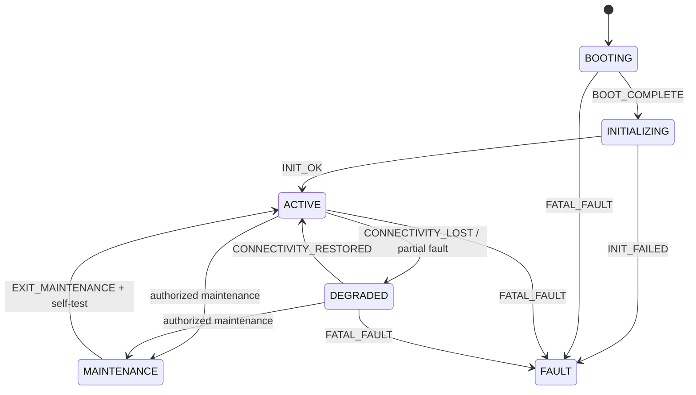

# Node State Machine

```mermaid
stateDiagram-v2
  [*] --> BOOTING
  BOOTING --> INITIALIZING: BOOT_COMPLETE
  INITIALIZING --> ACTIVE: INIT_OK
  INITIALIZING --> FAULT: INIT_FAILED
  ACTIVE --> DEGRADED: CONNECTIVITY_LOST / partial fault
  DEGRADED --> ACTIVE: CONNECTIVITY_RESTORED
  ACTIVE --> MAINTENANCE: authorized maintenance
  DEGRADED --> MAINTENANCE: authorized maintenance
  MAINTENANCE --> ACTIVE: EXIT_MAINTENANCE + self-test
  BOOTING --> FAULT: FATAL_FAULT
  ACTIVE --> FAULT: FATAL_FAULT
  DEGRADED --> FAULT: FATAL_FAULT
```
