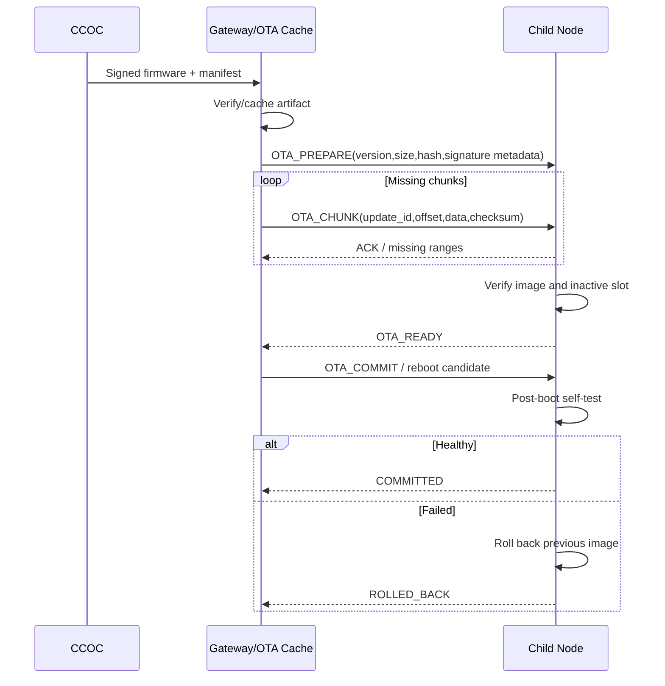

# Gateway-Relayed OTA Sequence

```mermaid
sequenceDiagram
  participant C as CCOC
  participant G as Gateway/OTA Cache
  participant N as Child Node
  C->>G: Signed firmware + manifest
  G->>G: Verify/cache artifact
  G->>N: OTA_PREPARE(version,size,hash,signature metadata)
  loop Missing chunks
    G->>N: OTA_CHUNK(update_id,offset,data,checksum)
    N-->>G: ACK / missing ranges
  end
  N->>N: Verify image and inactive slot
  N-->>G: OTA_READY
  G->>N: OTA_COMMIT / reboot candidate
  N->>N: Post-boot self-test
  alt Healthy
    N-->>G: COMMITTED
  else Failed
    N->>N: Roll back previous image
    N-->>G: ROLLED_BACK
  end
```
