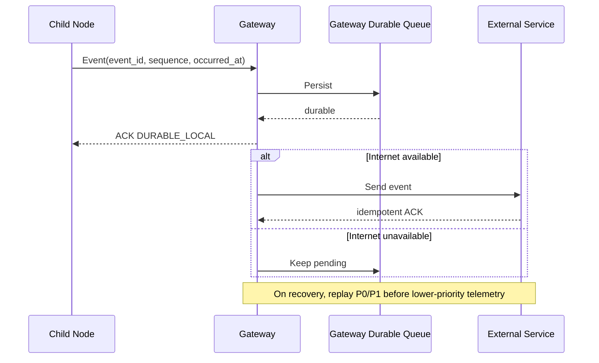

# Store-and-Forward Sequence

```mermaid
sequenceDiagram
  participant N as Child Node
  participant G as Gateway
  participant Q as Gateway Durable Queue
  participant E as External Service
  N->>G: Event(event_id, sequence, occurred_at)
  G->>Q: Persist
  Q-->>G: durable
  G-->>N: ACK DURABLE_LOCAL
  alt Internet available
    G->>E: Send event
    E-->>G: idempotent ACK
  else Internet unavailable
    G->>Q: Keep pending
  end
  Note over G,E: On recovery, replay P0/P1 before lower-priority telemetry
```
