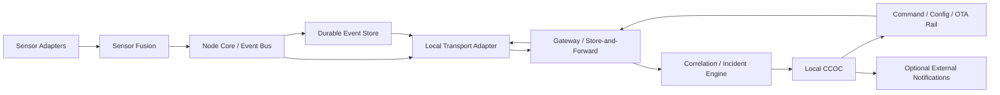

# System Component Diagram

```mermaid
flowchart LR
  S[Sensor Adapters] --> F[Sensor Fusion]
  F --> NC[Node Core / Event Bus]
  NC --> Q[Durable Event Store]
  NC --> T[Local Transport Adapter]
  Q --> T
  T --> GW[Gateway / Store-and-Forward]
  GW --> COR[Correlation / Incident Engine]
  COR --> CCOC[Local CCOC]
  CCOC --> CMD[Command / Config / OTA Rail]
  CMD --> GW
  GW --> T
  CCOC --> OUT[Optional External Notifications]
```
